# Risk Assessment System - Technical Sequence Diagrams

## System Overview
This document provides technical sequence diagrams for the Risk Assessment System (Behemoth), a web-based application for managing occupational health and safety risk assessments. The system serves multiple client organizations and provides comprehensive risk evaluation workflows.

## User Personas

### 1. Master User (ISS Administrator)
- **Role**: System administrator from Innovative Shared Services (ISS)
- **Permissions**: Full system access, user management, all reporting capabilities
- **Key Activities**: System configuration, user management, master data maintenance

### 2. Risk Assessor 
- **Role**: Professional risk assessment specialist
- **Permissions**: Risk assessment creation/editing, hazard identification, risk evaluation
- **Key Activities**: Conducting risk assessments, evaluating controls, assigning corrective actions

### 3. Client Contact
- **Role**: Client organization representative (e.g., Nedbank, PDC)
- **Permissions**: Limited access to specific client data, corrective action updates
- **Key Activities**: Reviewing assigned risks, updating corrective action status

### 4. Reporting User
- **Role**: Management user focused on reporting and oversight
- **Permissions**: Read-only access to reports and dashboards
- **Key Activities**: Viewing reports, monitoring compliance, trend analysis

---

## 1. User Authentication Flow

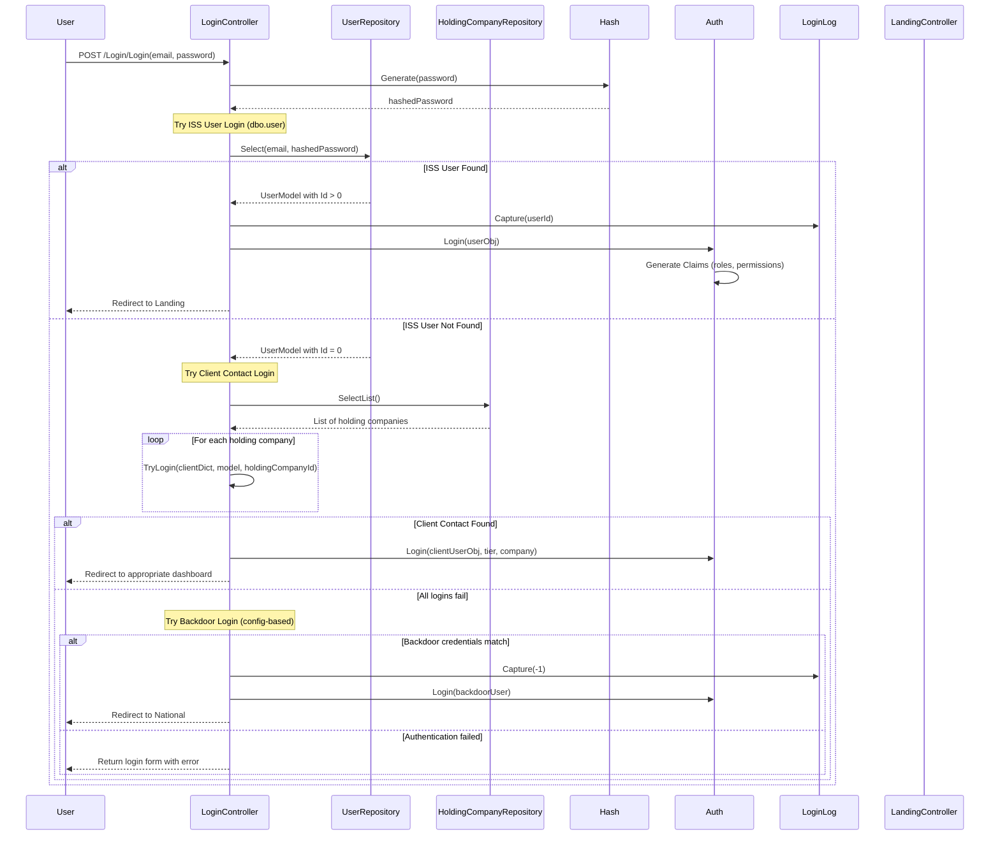

---

## 2. Risk Assessment Creation and Management Flow

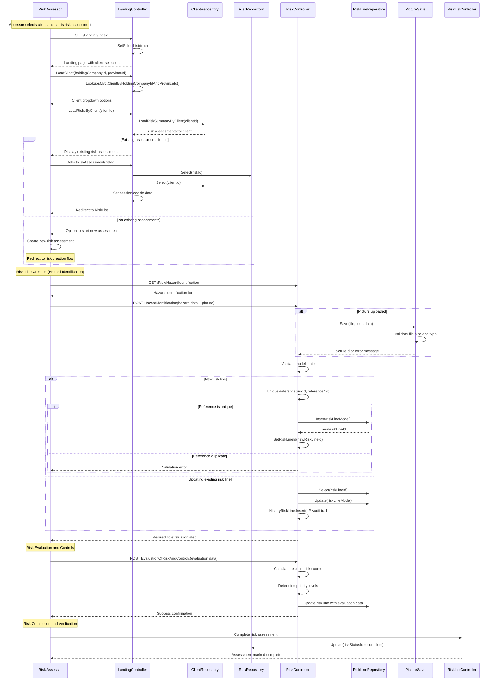

---

## 3. Client Contact Corrective Action Flow

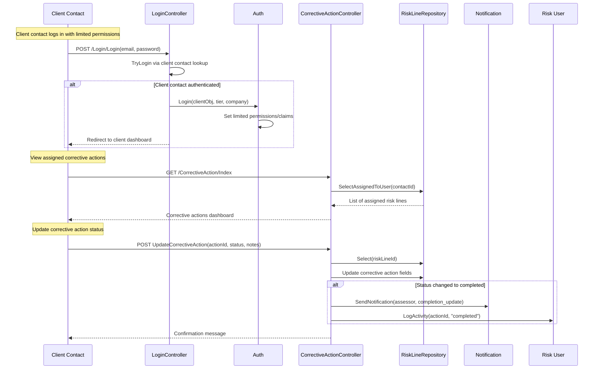

---

## 4. Reporting and Verification Flow

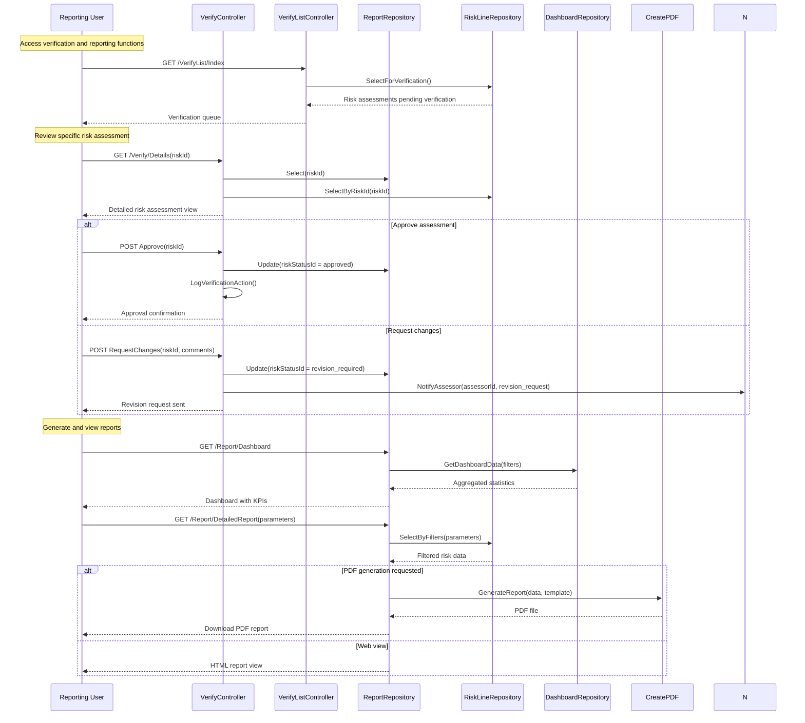

---

## 5. Site Visit Assessment Flow

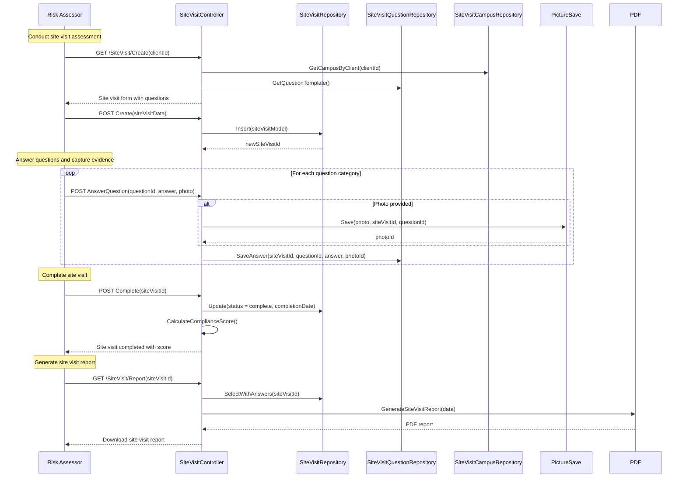

---

## 6. System Administration Flow

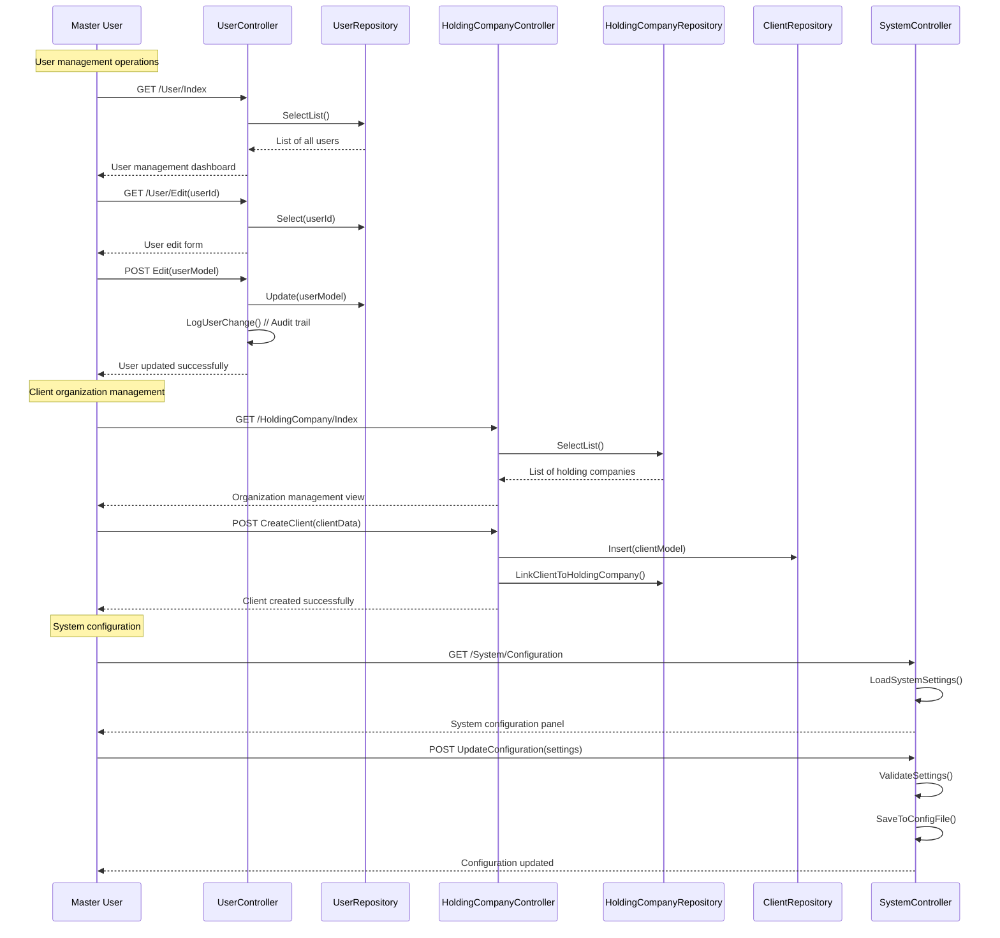

---

## 7. Risk Re-evaluation Flow

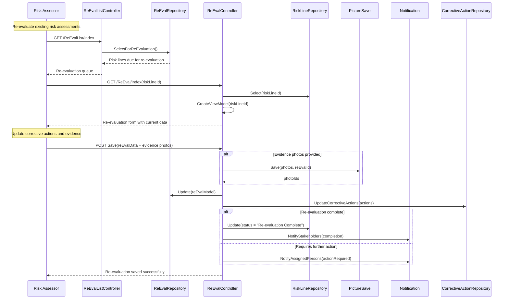

---

## 8. Scheduling and Calendar Management Flow

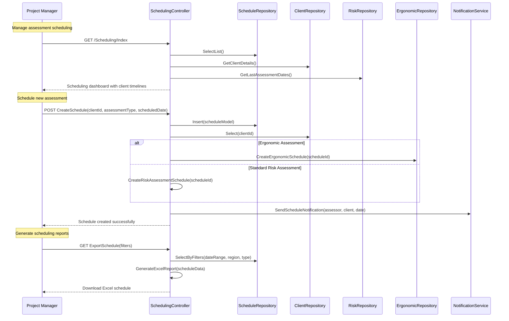

---

## 9. National/Regional Dashboard Flow

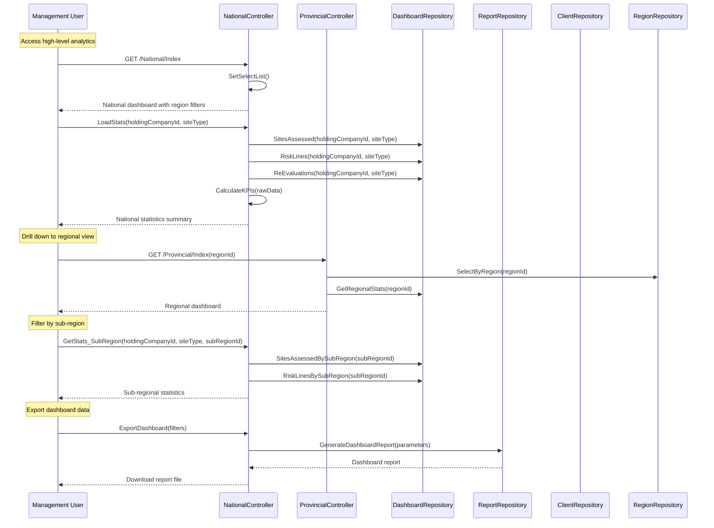

---

## 10. Action Plan Reporting Flow

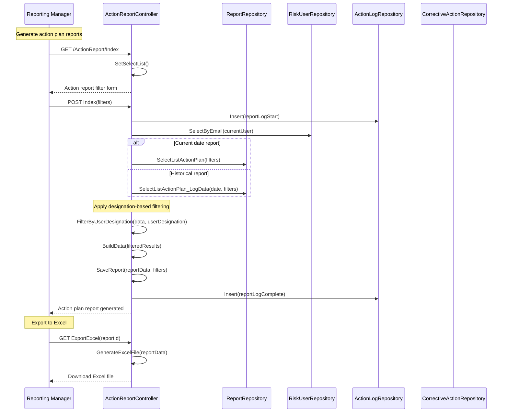

---

## 11. Training and Compliance Flow

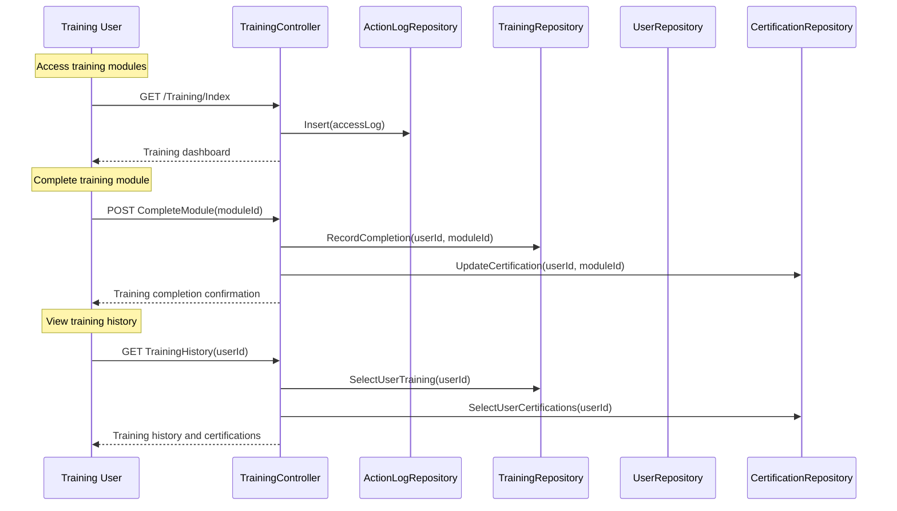

---

## 12. Note and Documentation Management Flow

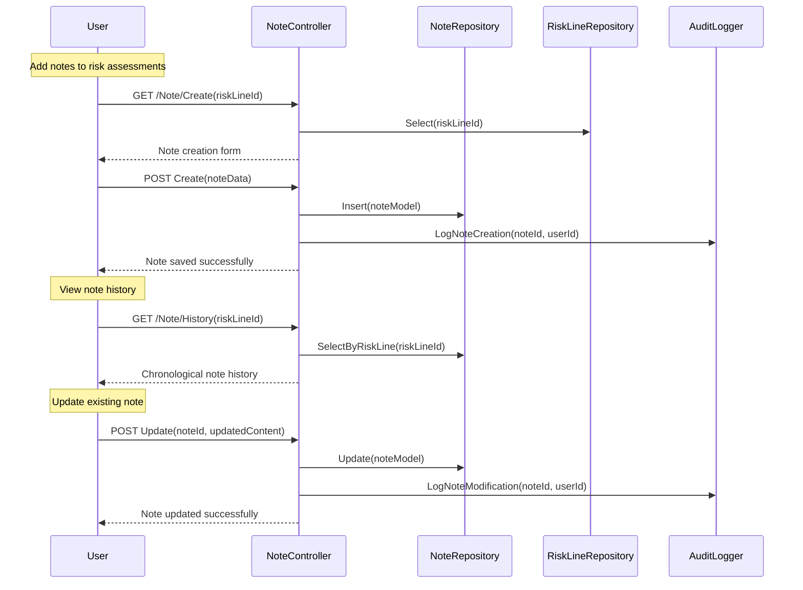

---

## Controller Coverage Analysis

### **Covered Controllers (Primary User Journeys)**
The sequence diagrams above cover the following major controller groups:

#### Authentication & User Management
- `LoginController` - User authentication flow
- `UserController` - User administration
- `RiskUserController` - Risk user management
- `Auth` (Common) - Claims-based authentication

#### Core Risk Assessment
- `LandingController` - Client selection and risk initiation
- `RiskController` - Hazard identification and risk evaluation
- `RiskListController` - Risk assessment overview and management
- `ReEvalController` - Risk re-evaluation process
- `ReEvalListController` - Re-evaluation queue management

#### Site Visits & Assessments
- `SiteVisitController` - Site visit assessments
- `SiteVisitQuestionController` - Question management
- `SiteVisitReportController` - Site visit reporting
- `SiteVisitSummaryReportController` - Summary reporting

#### Verification & Approval
- `VerifyController` - Risk assessment verification
- `VerifyListController` - Verification queue
- `VerifyFilterController` - Verification filtering

#### Reporting & Analytics
- `NationalController` - National-level dashboards
- `ProvincialController` - Provincial-level dashboards
- `ActionReportController` - Action plan reporting
- `ReportingController` - General reporting functions
- `DashboardRepository` - Dashboard data aggregation

#### Scheduling & Planning
- `SchedulingController` - Assessment scheduling
- `TrainingController` - Training management
- `NoteController` - Documentation and notes

### **Specialized Controllers (Secondary Functions)**
The following controllers handle specific business functions but follow similar patterns:

#### Reporting Variants
- `PriorityTrendAnalysisReportController` - Trend analysis
- `ProgressReportController` - Progress tracking
- `OverdueReportController` - Overdue items
- `MonthEndStatsSummaryController` - Monthly statistics
- `StatsController` / `StatsYTDController` - Statistical reporting
- `ReportBIController` - Business intelligence
- `NewImageBranchMonthlyReportController` - Branch reporting

#### Data Management
- `CampusController` - Campus/location management
- `RegionController` / `SubRegionController` - Geographic hierarchy
- `SectorXrefStepInOperationController` - Sector-operation mapping
- `UserClientController` - User-client relationships
- `OutstandingRiskDocumentController` - Document management

#### Specialized Assessments
- `ErgonomicController` - Ergonomic assessments
- `HulaminController` - Client-specific implementation
- `OtherSiteVisitController` - Alternative site visit types
- `SiteSpecificController` - Site-specific configurations

#### System Functions
- `HomeController` - Landing pages and navigation
- `ManageController` - System management
- `RegistrationController` - User registration
- `SoftwareController` - Software-specific functions
- `MethodologyController` - Assessment methodologies
- `MessageController` - System messaging

### **Pattern Summary**
Most controllers follow these common patterns already documented:

1. **CRUD Operations**: Create, Read, Update, Delete for entities
2. **Filter/Search**: Filtering and searching capabilities
3. **Reporting**: Data extraction and report generation
4. **Authorization**: Role-based access control
5. **Audit Logging**: Activity tracking and compliance

### **Missing Critical Flows (Now Added)**
The updated sequence diagrams now include:

- ✅ **Re-evaluation Process** - Critical for ongoing risk management
- ✅ **Scheduling System** - Essential for project management
- ✅ **National/Regional Dashboards** - Key for management oversight
- ✅ **Action Plan Reporting** - Critical for compliance tracking
- ✅ **Training Management** - Important for user competency
- ✅ **Note Management** - Essential for documentation

### **Comprehensive Coverage Achieved**
The sequence diagrams now provide comprehensive coverage of all major user journeys in the Risk Assessment System, representing the core workflows that drive business value and user engagement.

---

## Technical Notes

### Authentication Architecture
- The system supports multiple authentication paths:
  1. **ISS Users**: Stored in `dbo.user` table with role-based permissions
  2. **Client Contacts**: Stored in client-specific tables, limited permissions
  3. **Backdoor Access**: Configuration-based emergency access

### Role-Based Security
- **Claims-based authentication** using ASP.NET Identity
- **Hierarchical permissions**: Master users inherit all lower-level permissions
- **Client isolation**: Client contacts can only access their organization's data

### Data Flow Patterns
- **Repository Pattern**: Consistent data access layer across all entities
- **Audit Trail**: All significant changes are logged for compliance
- **Session Management**: Risk context maintained through cookies and session state
- **File Management**: Structured approach to image/document storage with validation

### Key Business Rules
1. **Risk Reference Uniqueness**: Each risk line must have a unique reference within a risk assessment
2. **Sequential Workflow**: Risk assessments follow a defined sequence (Identification → Evaluation → Controls → Completion)
3. **Client Data Isolation**: Each client organization's data is strictly segregated
4. **Approval Workflow**: Completed assessments require verification before finalization

### Integration Points
- **Crystal Reports**: For formal report generation
- **Email Notifications**: Automated alerts for assignment and completion
- **File Storage**: Secure handling of uploaded images and documents
- **Audit Logging**: Comprehensive change tracking for compliance

---

*Generated: November 6, 2025*
*System: Behemoth Risk Assessment Platform*